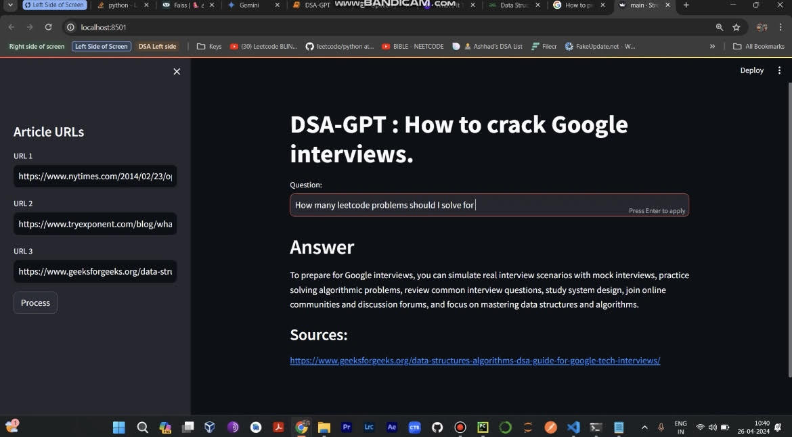

# DSA-GPT: Your AI Study Buddy for Cracking Coding Interviews (RAG-powered Q&A with OpenAI)
# Created by : Madhumitha Kolkar , 2024



## Features

- Load URLs or upload text files containing URLs to fetch article content.
- Process article content through LangChain's UnstructuredURL Loader
- Construct an embedding vector using OpenAI's embeddings and leverage FAISS, a powerful similarity search library, to enable swift and effective retrieval of relevant information
- Interact with the LLM's (Chatgpt) by inputting queries and receiving answers along with source URLs.


Channel your inner coder with DSA-GPT, your one-stop shop for mastering Data Structures and Algorithms (DSA) concepts in preparation for those all-important coding interviews. This innovative project leverages cutting-edge AI technology to provide you with a personalized learning experience.

## Technology Stack:

Langchain: A powerful library for facilitating retrieval of relevant information from various sources. FAISS: A state-of-the-art library for creating efficient and scalable data structures for information retrieval. OpenAI LLM: A cutting-edge large language model from OpenAI, capable of processing information and generating human-quality text. Streamlit: A user-friendly framework for creating interactive web applications, making DSA-GPT accessible to all. Installation (if applicable):

Dependencies: langchain streamlit==1.22.0 unstructured==0.9.2 tiktoken==0.4.0 faiss-cpu==1.7.4 libmagic==1.0 python-magic==0.4.27 python-magic-bin==0.4.14 OpenAI

## Usage:

Clone the Repository: Use git clone https://github.com/your-madhumithakolkar/DSA-GPT.git to download the project. Set Up Dependencies (if applicable): Follow the instructions to install any necessary dependencies. Run the App: Navigate to the project directory and execute streamlit run main.py. DSA-GPT's Streamlit interface will launch in your web browser. Provide URLs and Ask Questions: Enter the URLs of relevant DSA articles or tutorials in the designated field. Craft your questions related to the provided content, and DSA-GPT will retrieve and answer them, helping you solidify your understanding. 

## Future Enhancements:

Code Snippet Generation: Explore integration with code generation models to potentially provide sample code snippets along with explanations. Customization: Allow for personalization of the knowledge retrieval process based on user preferences (e.g., prioritizing specific sources). Advanced Question Answering: Incorporate techniques like question reformulation and reasoning to handle more complex question types. Contributing:

We welcome contributions to DSA-GPT! Feel free to fork the repository, propose improvements, and create pull requests. Let's build a robust DSA learning companion together!

Link to video : https://www.linkedin.com/posts/madhumithakolkar_google-leetcode-rag-activity-7189504086386397186-oLot?utm_source=share&utm_medium=member_desktop


## Installation

1.Clone this repository to your local machine using:

```bash
  git clone https://github.com/your-madhumithakolkar/DSA-GPT.git
```
2. Install the required dependencies using pip:

```bash
  pip install -r requirements.txt
```
3.Set up your OpenAI API key by creating a .env file in the project root and adding your API

```bash
  OPENAI_API_KEY=your_api_key_here
```
## Usage/Examples

1. Run the Streamlit app by executing:
```bash
streamlit run main.py

```

2.The web app will open in your browser.

- On the sidebar, you can input URLs directly.

- Initiate the data loading and processing by clicking "Process"

- Observe the system as it performs text splitting, generates embedding vectors, and efficiently indexes them using FAISS.

- The embeddings will be stored and indexed using FAISS, enhancing retrieval speed.

- The FAISS index will be saved in a local file path in pickle format for future use.
- One can now ask a question and get the answer based on those news articles

## Project Structure

- main.py: The main Streamlit application script.
- requirements.txt: A list of required Python packages for the project.
- faiss_store_openai.pkl: A pickle file to store the FAISS index.
- .env: Configuration file for storing your OpenAI API key.